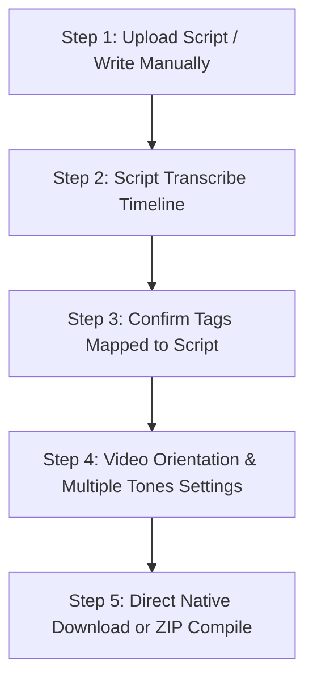

# AI B-Roll Downloader - Architecture & Changes Documentation

This document serves as a comprehensive reference of the application architecture, file structure, and specific implemented changes. Presenting this file to any developer or AI coding assistant will instantly convey how the system operates and how components interact.

---

## 1. Project Overview & Workflow Pipeline

The AI B-Roll Downloader is a premium cross-platform web application designed to convert dialogue scripts into structured stock asset B-roll packages. The workflow operates as a 5-step progressive wizard:



1. **Ingestion (Upload Page)**: Ingests an `.srt` subtitle track or bypasses directly to manual script typing.
2. **Transcription Editor (Script Editor)**: A dual-mode Premiere Pro style screen. Users can edit/paste raw script dialogue and click "Auto-Transcribe" to partition it into timed timing cues.
3. **Keyword Refinement (Tags Page)**: Displays each timing cue side-by-side with its matching visual search tags (auto-generated using offline NLP / Groq Llama models) for double-click editing.
4. **Vibe Customization (Video Settings)**: Configures video dimensions (landscape, vertical, square) and supports selecting **multiple aesthetic tones** simultaneously.
5. **Compilation Pipeline (Download Page)**: Runs concurrent, rate-limited stock video and image searches, downloads files directly to a native local directory (supporting Windows and macOS folders) or wraps them in a structured `.zip` package.

---

## 2. File & Directory Structure

Here is a map of the primary files involved in the core B-roll pipeline:

```
h:/CHIGGYS Scripting/
├── backend/
│   ├── controllers/
│   │   └── projectController.js       # Express controllers (transcribe, folder pickers, folder openers)
│   ├── routes/
│   │   └── api.js                     # Backend API endpoints (e.g. /upload, /transcribe, /tags/generate)
│   ├── services/
│   │   ├── aiService.js               # Groq Llama orchestrator (chunked story, tag pools)
│   │   ├── downloadService.js         # Concurrent stock file downloader queue
│   │   ├── metadataService.js         # Generates structural metadata.json for the asset pack
│   │   ├── pexelsService.js           # Pexels search client with multi-tone query enriches
│   │   ├── pixabayService.js          # Pixabay video/image/shape client with multi-tone enriches
│   │   ├── srtParserService.js        # Parses standard .srt files into clean time blocks
│   │   ├── tagGeneratorService.js     # Rule-based local NLP keyword extractor (offline fallback)
│   │   ├── unsplashService.js         # Unsplash search client for image fallbacks
│   │   ├── vecteezyService.js         # Vecteezy V2 search client for premium fallback assets
│   │   └── zipService.js              # Synchronous in-memory ADM-ZIP compiler for asset packs
│   ├── index.js                       # Node.js/Express entrypoint
│   └── nodemon.json                   # Explicit nodemon settings to ignore dynamic directories
│
├── frontend/
│   ├── src/
│   │   ├── pages/                     # Frontend views
│   │   │   ├── UploadPage.vue         # Drag & Drop .srt upload + manual script bypass
│   │   │   ├── ScriptEditorPage.vue   # Tabbed Raw Script Text area + timed Premiere Cues Timeline
│   │   │   ├── TagsPage.vue           # Tag confirms list mapped to transcription lines
│   │   │   ├── VideoSettingsPage.vue  # Aspect ratio + multi-selection Aesthetic Tones configuration
│   │   │   └── DownloadPage.vue       # Download compiles with native cross-platform folder saves
│   │   ├── stores/
│   │   │   └── project.js             # Pinia store managing state & LocalStorage caching
│   │   ├── App.vue                    # Main layout containing the wizard navigation stepper
│   │   └── main.js                    # Vue app initialization
│   └── package.json                   # Frontend dependencies (Vue, Pinia, Axios, TailwindCSS)
│
├── .env                               # Root environment configuration (API Keys)
└── package.json                       # Workspace orchestrator script (concurrently dev commands)
```

---

## 3. Implemented Technical Changes

### A. Premiere Pro Transcription Timeline (`/editor` phase)
- **Manual Script Input**: Updated `UploadPage.vue` with a `"Write Script Manually"` trigger which initializes an empty project and skips file upload.
- **Tabbed Interface**: Redesigned `ScriptEditorPage.vue` to contain:
  1. **Raw Script Tab**: Large script dialogue entry textbox with a `"🪄 Auto-Transcribe to Timeline"` trigger.
  2. **Premiere Timeline Tab**: High-contrast list of timed rows featuring start time, end time, and text inputs with cue add/remove capabilities.
- **Transcription Endpoint**: Added `/api/transcribe` to the Express router, handled by `transcribeScript` in `projectController.js`:
  - **AI Mode**: Sends dialogue script to Groq API asking Llama-3.1 to generate sequential, timed dialogue objects.
  - **Offline Fallback**: Splits script by punctuation, allocating durations logically based on sentence word counts (2.5 words/sec).
- **Tab-Syncing Real-Time Updates**: Modified `ScriptEditorPage.vue` to dynamically reconstruct the continuous raw text from individual timeline cue blocks whenever switching back to the raw script editor tab, keeping the raw script dialogue and timeline blocks perfectly in sync.
- **Re-Transcription Stale Purging**: Updated `transcribeScript` in `projectController.js` to automatically clear out any old visual stories, subtitles with tags, and tag pool files upon re-transcribing, ensuring clean, fresh AI regeneration cycles.

### B. Multiple Aesthetic Tone Selection
- **Multi-Selection Toggles**: Modified `VideoSettingsPage.vue` to allow selecting **multiple aesthetic tones** simultaneously (stored as comma-separated values in LocalStorage).
- **Search Query Enrichment**: Updated the query enriches in `pexelsService.js` and `pixabayService.js` to parse comma-separated aesthetic strings, appending matching descriptors to searches (e.g. `cinematic warm glow` for *Cinematic* + *Warm Golden*).
- **Graceful Previews**: Configured the preview monitor mockup in the settings page to cleanly draw visual mockups based on the *first* active visual tone selected in the multi-tone array.

### C. Native Cross-Platform Folder Downloader & Opener
- Added robust OS-level detection to support direct downloads and folder openings on both Windows and macOS systems inside `projectController.js`:
  - **macOS Folder Picker**: Runs AppleScript via `osascript` to trigger the native macOS folder browse dialog:
    ```bash
    osascript -e 'POSIX path of (choose folder with prompt "Select Destination Folder")'
    ```
  - **macOS Finder Opener**: Launches `open "<path>"` to reveal the download destination folder directly in Finder.
  - **Windows Dialog & Explorer**: Retained PowerShell `FolderBrowserDialog` and `explorer "<path>"` wrappers.
  - **UI Badge**: Updated the folder selection description card in `DownloadPage.vue` to badge itself as **Windows & macOS Native**.

### D. ZIP Generation Corruption & Nodemon Stability Fixes
- **Nodemon Watch Exclusions**: Added `nodemon.json` to the backend root directory to explicitly ignore the dynamically changing `downloads/`, `uploads/`, and `temp/` directories. This prevents the server from restarting mid-compilation when writing files, resolving ZIP corruption errors (*"End of Central Directory record could not be found"*).
- **ADM-ZIP Migration & Path Stability**: Migrated `zipService.js` to use the `adm-zip` library for completely synchronous, in-memory directory zipping. This writes the finished ZIP directly to disk, fully resolving all asynchronous timing race conditions and platform glob backslash path mismatches under Windows, while compiling a clean flat ZIP format with files placed at the root of the archive.

### E. 3-Minute Post-Compilation Automatic Expiry & Quick Delete Purge
- **Automatic Purge Cycle**: Configured a `scheduleProjectCleanup(projectId)` helper method in `projectController.js` which sets a 3-minute (180,000 ms) automatic countdown timer immediately after successful ZIP compilation.
- **Manual Quick Delete Endpoints**: Added `/api/cleanup/:projectId` POST endpoint that clears active timeout schedules on the backend and immediately invokes `executeProjectCleanup(projectId)` to purge folders.
- **Physical & Memory Purge**: On timer expiration or manual quick delete trigger, the server completely deletes all project resources to secure user data and prevent storage clogging:
  - Deletes physical uploads folder (`uploads/${projectId}`)
  - Deletes physical downloads folder (`downloads/${projectId}`)
  - Deletes completed ZIP package (`downloads/${projectId}.zip`)
  - Deletes physical progress tracking file (`downloads/.progress/${projectId}.json`)
  - Clears in-memory progress states and keys from the `downloadService` active progress registry.
- **Interactive UI Expiry Banner**: Implemented a reactive, real-time ticking clock display banner inside the frontend `DownloadPage.vue` success panel alongside an active **Quick Delete** button, fully linking the client-server file expiry states.

### F. Multiple Fallback Search Engine Integrations (Unsplash & Vecteezy)
- **Unsplash Search Client (`unsplashService.js`)**: Created a REST API integration client targeting the Unsplash Photo Search API, mapping vertical/landscape aspect ratios and utilizing query cache registries.
- **Vecteezy V2 Search Client (`vecteezyService.js`)**: Created a REST API integration client targeting the premium Vecteezy API V2 `/v2/{account_id}/resources` with authorization headers, cache tables, and query filters.
- **Active Engine UI Badges**: Added glowing green pulse badges for `Unsplash Engine Active` and `Vecteezy Engine Active` to the global header/footer in `App.vue`, and updated the pipeline compilation description in `DownloadPage.vue`.
- **Integrated Fallback Routine**: Modified the image search thread in `projectController.js` to fall back to Unsplash and Vecteezy searches simultaneously if both Pexels and Pixabay return zero photos, maximizing final timeline coverage.
